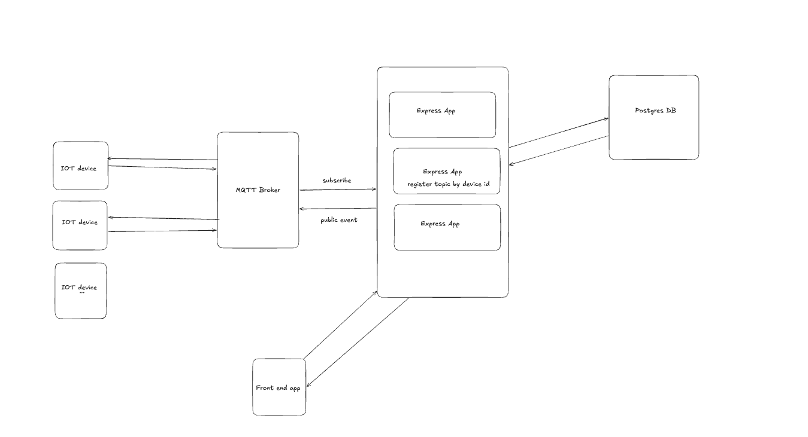

# Assessment

Beacon dashboard. The browser talks to an Express API. The API stores beacons in Postgres and is the only client of the MQTT broker.

How the pieces connect is in [SYSTEM_DESIGN.md](SYSTEM_DESIGN.md).



## Run

You need Node.js 22+. Start Postgres and the API before the frontend.

### Backend

Run these commands from `backend`. The CA file must be at `backend/cert/emqxsl-ca.crt`.

```bash
cd backend
npm install
cp .env.example .env
docker compose up -d db
npm run migrate
npx knex seed:run --knexfile knexfile.cjs
npm run dev
```

The API listens on `http://localhost:3000`. `npm run dev` restarts on code changes. `npm start` runs once. Both load `src/server.js` with the `@/` alias.

Do not commit `.env`. `DATABASE_URL` points at `localhost:5432` and database `assessment`. Edit the MQTT URL, username, password, and certificate path.

Migration and seed files must use `.cjs`. The first migrate prints `Batch 1 run: 1 migrations`. Seed prints `Ran 1 seed files` when `src/db/seeds/seed_beacons.cjs` is found.

Roll back the latest migration with `npm run migrate:rollback`.

`docker compose up --build` starts Postgres and the API together. The API container migrates, then starts the server. Inside Compose, `DATABASE_URL` uses host `db`.

| Variable | Meaning |
| --- | --- |
| `PORT` | HTTP port, default `3000` |
| `DATABASE_URL` | Postgres connection string |
| `MQTT_URL` | Broker URL (`mqtts://` for TLS) |
| `MQTT_CERTIFICATE` | CA file path, relative to `backend` |
| `MQTT_USERNAME` / `MQTT_PASSWORD` | Broker credentials |
| `MQTT_CLIENT_ID` | MQTT client id |
| `MQTT_QOS` | Publish QoS |

Uplink is `zena/{deviceId}/data`. Commands go to `zena/{deviceId}/cmd`. The prefix is `baseTopic` in `backend/src/config/mqtt.config.js`.

### Frontend

Start this only after `http://localhost:3000` answers. The page loads beacons from that API on startup.

Run these commands from `frontend`.

```bash
cd frontend
npm install
cp .env.example .env
npm run dev
```

1. `npm install` installs React, Vite, and the chart library.
2. `cp .env.example .env` creates the env file. `VITE_API_URL` is the backend origin, default `http://localhost:3000`. Do not commit `.env`. Vite reads this file only when the dev server starts, so stop and run `npm run dev` again after you change it.
3. `npm run dev` starts Vite. Open `http://localhost:5173`. The first paint loads `App`, which applies the shared styles and shows the `/` dashboard.

Leave that terminal open. Saving a file reloads the page. Stop the server with Ctrl+C.

`npm run build` writes a production bundle to `frontend/dist`. `npm run preview` serves that bundle on a local port so you can check the build without the dev server.

`App` is the shell. It loads the shared styles once, then renders whichever page matches the URL. A new screen is a component in `frontend/src/pages` plus one `{ path, Component }` entry in `frontend/src/routes/routes.js`. Any other path redirects to `/`.

`/` is `MonitorPage`. The left side is a scrolling list of beacon cards. Each card shows volume, SPL, temperature, RSSI, and an LED switch. The switch calls `POST /beacons/:id/command` with `SET_LED`. The list pages with Previous and Next. The right side is the live chart for the selected beacon.

`useMonitor` ties that screen together. The first loaded beacon is selected once. A click updates `deviceId` immediately, but the stream waits 400 ms so rapid clicks open only one connection. That settled id loads the beacon page and opens `GET /messages/stream`. Each message is drawn at once. The chart keeps the newest 20. Changing the beacon clears the chart first.

Beacon cards live in `frontend/src/components/beacon`. The chart lives in `frontend/src/components/message`. HTTP calls live in `frontend/src/api` and always use `VITE_API_URL`.

## API

- `GET /beacons?page=1&limit=10` returns `{ data, pagination }`.
- `GET /beacons/:id` returns one row, or `404` when that id does not exist.
- `POST /beacons` creates a row. `PUT /beacons/:id` updates one. `DELETE /beacons/:id` deletes one.
- `POST /beacons/:id/command` publishes a command:
  - `{ "action": "SET_LED", "enabled": true }`
  - `{ "action": "SET_VOLUME", "value": 40 }`
  - `{ "action": "TURN_OFF" }`
- `GET /messages/stream?deviceId=` streams that device's MQTT messages as Server-Sent Events.

## Layout

```
backend/src/server.js            start HTTP and MQTT
backend/src/app.js               mount routers and middleware
backend/src/config/              database and MQTT settings
backend/src/routes/              map URL to controller
backend/src/controllers/         handle the request
backend/src/services/            application logic
backend/src/repositories/        read and write the database
backend/src/schema/              request validation
backend/src/mqtt/                connection, subscribe, and publish
backend/src/db/                  Knex client, migrations, and seeds
frontend/src/main.jsx            mount React
frontend/src/App.jsx             shared styles and router
frontend/src/routes/routes.js    path to page component
frontend/src/pages/              screens
frontend/src/components/         beacon card and live chart
```
